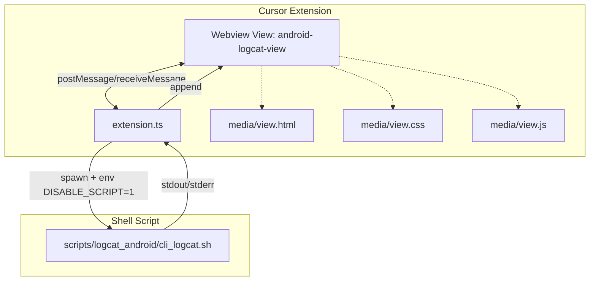

[TOC]

### android-logcat（Cursor 插件）

这是我为 Cursor 打造的一个最小但实用的 Android Logcat 面板插件。它在底部 Toggle Panel 中提供了一个名为 “android logcat” 的标签页，支持选择设备、包名、Tag、Level、Buffer，并可一键开始/停止、保存日志到文件。

#### 架构概览



- Webview 层（`view.html` + `view.css` + `view.js`）渲染 UI，所有交互通过 `postMessage` 与 `extension.ts` 通信。
- 扩展后端（`extension.ts`）用 `child_process.spawn` 调用 `cli_logcat.sh`，通过 `--no-color` 输出加上 `DISABLE_SCRIPT=1` 环境变量，避免 `script` 在无 TTY 环境报错；实时把日志流写回 Webview。
- 脚本层：我把原来的 `cli_logcat.sh` 内置到了 `scripts/logcat_android/` 下；默认不需要用户额外配置。

#### 主要能力
- 面板位置：底部 Toggle Panel 顶部标签 “android logcat”（带图标）。
- 设备获取：`adb devices -l` 自动列出可选设备。
- 过滤配置：包名、Tag（多 tag 支持脚本侧已有）、Level、Buffer。
- 开始/停止：流式显示日志；可选“保存到文件（-f）”。

#### 本地开发与编译
1) 安装依赖与构建
```bash
npm install
npm run compile
```
2) 调试运行
- 在 Cursor 中 F5 选择 “Run Extension” 启动新的开发宿主窗口。
- 打开底部面板，切换到 “android logcat”。

3) 必备依赖
- 需要安装 adb：
  - macOS: `brew install android-platform-tools`
  - Windows: 安装 Android Platform-Tools，并把 `adb` 加入 PATH（脚本为 bash）。

#### 配置
- `cursorAndroidLogcat.scriptPath`：可覆盖默认脚本路径。
  - 默认留空：自动指向扩展内置脚本 `scripts/logcat_android/cli_logcat.sh`。

#### 打包 VSIX
1) 生成 VSIX
```bash
# 项目根目录
npm run compile
npx @vscode/vsce package
# 生成：cursor-android-logcat-x.y.z.vsix
```
2) 安装 VSIX
- Cursor 命令面板（Cmd+Shift+P）→ Extensions: Install from VSIX… → 选择 VSIX。
- 或命令行（启用 `cursor` 命令后）：
```bash
cursor --install-extension /path/to/cursor-android-logcat-x.y.z.vsix
```

已适配 Cursor 1.99.x：`engines.vscode` 与 `@types/vscode` 均匹配该版本。

#### 项目结构（关键文件）
```
cursor-android-logcat/
  ├─ src/extension.ts           # 后端：注册视图、设备获取、脚本启动、流式回传
  ├─ media/
  │   ├─ view.html              # Webview 模板（占位符注入 CSP、nonce、样式与脚本）
  │   ├─ view.css               # UI 样式（固定工具行，日志区域自适应）
  │   └─ view.js                # 前端交互（postMessage、设备刷新、启停）
  ├─ scripts/logcat_android/
  │   └─ cli_logcat.sh          # 内置 logcat 脚本（支持 -s/-p/-t/-l/-b 等）
  ├─ package.json               # 插件清单、命令与视图、配置项、依赖
  ├─ tsconfig.json
  ├─ .gitignore                 # 过滤 node_modules/out/logs 等
  └─ .vscodeignore              # VSIX 体积优化
```

#### 兼容性处理
- `DISABLE_SCRIPT=1`：在无 TTY 的管道环境下禁用 `script` 包装，避免 `tcgetattr/ioctl` 错误。
- `--no-color`：脚本输出去色，保证 Webview 文本匹配与渲染稳定（后续可切换为前端 ANSI 渲染）。
- 固定 `cwd`：启动脚本时将工作目录设为扩展目录，确保 `logs/` 可写。

#### 后续可做
- ANSI 彩色渲染（xterm.js 或 ansi-to-html）。
- 正则过滤（`--grep/--exclude`）的前端输入映射。
- 一键清空、复制全部、导出当前视图。


