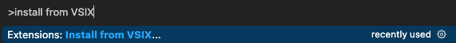
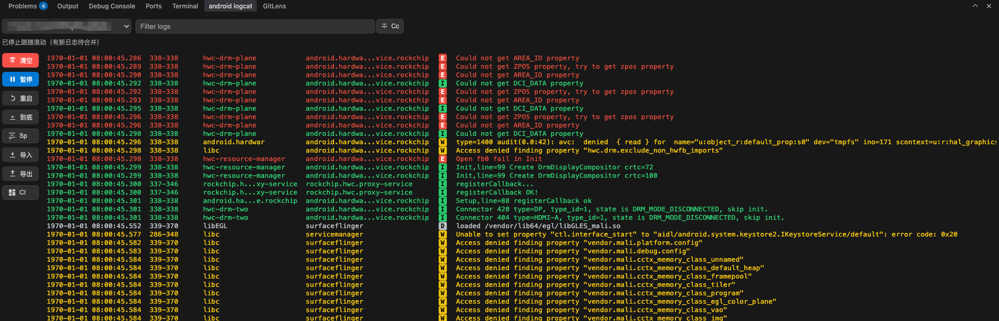
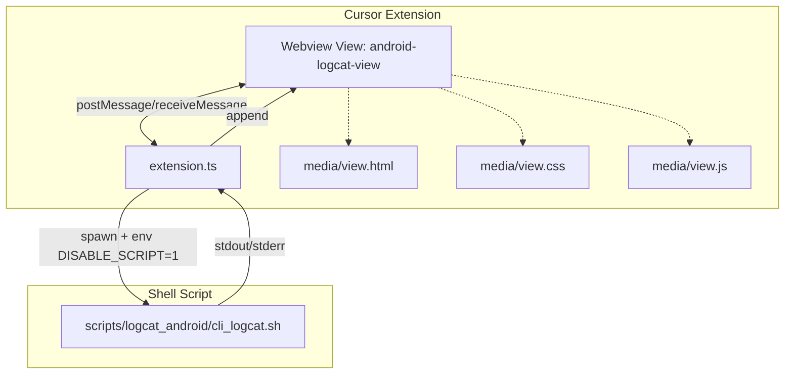

[TOC]

### 插件安装方式
1. 打开Cursor->顶部导航栏View->Command Palette。
2. 输入Extensions: Install from VSIX...。

3. 在项目工程./vsix_directory目录选择需要安装的vsix文件。
4. 安装完成后，重启Cursor。
5. 打开右上角Toggle Panel->然后选择android logcat。


### android-logcat（Cursor插件）
为 Cursor打造的一个轻量且实用的 Android Logcat 面板插件。在底部 Toggle Panel 中提供 “android logcat” 标签页，支持设备选择、实时过滤、大小写匹配、软换行、暂停/恢复、清空日志、按级别着色，以及将日志保存到文件。


#### 架构概览



- Webview 层（`view.html` + `view.css` + `view.js`）渲染 UI，所有交互通过 `postMessage` 与 `extension.ts` 通信。
- 扩展后端（`extension.ts`）使用 `child_process.spawn` 调用 `cli_logcat.sh`，通过 `--no-color` 输出加上 `DISABLE_SCRIPT=1` 环境变量，避免在无 TTY 环境报错；并对日志流做批量聚合与节流后回传到 Webview。
- 脚本层：内置 `scripts/logcat_android/cli_logcat.sh`，默认可直接使用。

#### 布局与主要能力
- 第一行（顶栏）：设备下拉框、保存到文件、过滤输入框、Cc（Match case）开关。输入框实时过滤当前视图。
- 第二行（状态）：展示当前跟随/暂停等状态提示。
- 第三行（主体）：
  - 左侧 50px 侧栏：按钮纵向排列（暂停/恢复、清空）、Sp（Soft-wrap）复选框。
  - 右侧日志视图：可滚动、支持软换行、按级别着色与快速过滤。

其它能力：
- 设备获取：`adb devices -l` 自动列出可选设备。
- 暂停/恢复：暂停仅停止向 UI 追加，进程不退出；恢复会一次性冲刷暂停期间缓存。
- 清空：仅清空 UI 与缓冲，不中断采集进程。
- 保存到文件：启用后传入 `-f` 由脚本侧保存。
- 跟随滚动：停留底部时自动跟随；离开底部时合并缓冲并提示。
- 颜色高亮：按行检测级别 V/D/I/W/E/F/S，应用对应颜色，提升可读性。
- 性能优化：扩展端 ~30fps/64KB 批量聚合后发送；隐藏时缓冲、显示时一次性冲刷；前端最大文本约 2MB，超限从头裁剪；requestAnimationFrame 批量渲染。
- 状态持久化：过滤词、Cc、Sp 状态使用 Webview state 持久化，切换 Tab 后仍保留。

快捷操作：
- 双击日志区域 / 点击状态栏 / 键盘 End：快速恢复到底部并继续跟随。

#### 本地开发与编译
1) 安装依赖与构建
```bash
npm install
npm run compile
```
2) 调试运行
- 在 Cursor 中 F5 选择 “Run Extension” 启动新的开发宿主窗口。
- 打开底部面板，切换到 “android logcat”。

3) 必备依赖
- 需要安装 adb：
  - macOS: `brew install android-platform-tools`
  - Windows: 安装 Android Platform-Tools，并把 `adb` 加入 PATH（脚本为 bash）。

#### 配置
- `cursorAndroidLogcat.scriptPath`：可覆盖默认脚本路径。
  - 留空：指向扩展内置脚本 `scripts/logcat_android/cli_logcat.sh`。
- `cursorAndroidLogcat.debug`：启用后输出调试日志到 `Android Logcat (Cursor)` 输出通道。

#### 打包 VSIX
1) 生成 VSIX
```bash
# 项目根目录
npm run compile
npx @vscode/vsce package
# 生成：cursor-android-logcat-x.y.z.vsix
```
2) 安装 VSIX
- Cursor 命令面板（Cmd+Shift+P）→ Extensions: Install from VSIX… → 选择 VSIX。
- 或命令行（启用 `cursor` 命令后）：
```bash
cursor --install-extension /path/to/cursor-android-logcat-x.y.z.vsix
```

已适配 Cursor 1.99.x：`engines.vscode` 与 `@types/vscode` 均匹配该版本。

#### 项目结构（关键文件）
```
cursor-android-logcat/
  ├─ src/extension.ts           # 后端：注册视图、设备获取、脚本启动、流式回传
  ├─ src/services/              # 业务服务（单一职责，可测试）
  │   ├─ DeviceService.ts       # 设备跟踪、offline 回填、列表推送
  │   ├─ StreamService.ts       # 进程与日志流管理、历史拉取
  │   └─ ImportService.ts       # 导入模式状态与文件读取
  ├─ src/utils/
  │   └─ path.ts                # 路径与文件名工具
  ├─ media/
  │   ├─ view.html              # Webview 模板（占位符注入 CSP、nonce、样式与脚本）
  │   ├─ view.css               # UI 样式（固定工具行，日志区域自适应）
  │   └─ view.js                # 前端交互（postMessage、设备刷新、启停）
  ├─ scripts/logcat_android/
  │   └─ cli_logcat.sh          # 内置 logcat 脚本（支持 -s/-p/-t/-l/-b 等）
  ├─ package.json               # 插件清单、命令与视图、配置项、依赖
  ├─ tsconfig.json
  ├─ .gitignore                 # 过滤 node_modules/out/logs 等
  └─ .vscodeignore              # VSIX 体积优化
```

#### 兼容性与脚本增强
- `DISABLE_SCRIPT=1`：在无 TTY 的管道环境禁用 `script` 包装，避免 `tcgetattr/ioctl` 错误。
- `--no-color`：脚本输出去色，颜色在前端按级别渲染，避免 ANSI 码导致的对齐问题。
- 固定 `cwd`：启动脚本时将工作目录设为扩展目录，确保 `logs/` 可写。
- 终端复位：脚本启动/退出时复位终端（`stty sane`/`tput sgr0`），避免异常退出后终端错乱；stdout 非 TTY 时强制关闭颜色，保证重定向/管道输出可读。

#### 后续可做
1. 智能摘要与日报
按当前过滤范围/时间窗自动生成问题摘要、变更点、潜在影响；支持一键写入 JIRA 工作日志或生成 Commit message。
2. 崩溃/ANR 根因定位助手
自动抓取并解析栈、合并相邻上下文（最近输入事件/Activity 切换/内存警告），给出“可能原因+排查步骤+修复建议”。
3. 语义搜索与自然语言过滤
输入“查 GPU 相关的 error，排除网络重试”→ 自动翻译成表达式（标签/包名/优先级/正则组合），并可保存为智能过滤器。
4. 相似日志聚类与去重
对重复/相似日志做语义聚类，列表只显示代表项+计数+趋势；点击展开查看全部实例，极大减少噪声。
5. 异常模式学习与预警
学习“正常基线”，当出现新标签、新关键字、新调用序列或分布突变时即时高亮并提示“新增异常模式”。
6. 跨源时间轴关联
自动按时间对齐 App、system_server、HAL/内核（可选）等来源，组装成一条“事件时间轴”，并支持“回放上一分钟上下文”。
7. 关键字段抽取与可视化
从日志中抽取 latency、FPS、温度、内存、分辨率等指标，自动绘图（时序曲线/直方图），并标注异常点。
8. 知识库联动（RAG）
将错误信息与团队 Wiki/JIRA 历史缺陷/提交记录/Release Note 做检索增强：提示“相似已知问题与处理方案/PR 链接”。
9. 上下文解释与术语释义
选中日志片段，AI 解释每个字段含义、涉及的系统组件/类方法、典型触发场景；可跳转到代码符号位置（结合项目索引）。
10. 自动复现步骤推测
基于一段时间的用户行为/系统广播/页面切换日志，推测“可能的用户操作链路”，辅助快速复现。
11. 一键生成工单/报告
打包当前过滤结果、设备信息、崩溃摘要、关键截图，生成结构化 JIRA/Tapd 工单；支持自动标签与优先级建议。
12. 脱敏与合规
自动识别并脱敏 PII（手机号、邮箱、IMEI、路径中的用户名等），导出/共享时确保合规；给出脱敏清单。
13. 历史相似度检索
本地向量索引（可选 SQLite/FAISS），跨会话检索历史相似问题；展示“相似度最高的 5 次出现及当时修复方式”。
14. 智能过滤器生成器
根据你点击的几条“想保留/想屏蔽”的日志，自动学习生成最小化过滤规则（含包名、Tag、优先级、正则与否）。
15. ADB/设备智能助手
结合日志上下文给出可执行的 adb/设置指令建议（例如抓取 bugreport、开启特定 debug 开关、导出特定 proc 节点）。

#### 已完成
1. 软换行-虚拟化窗口（解决上下快速滑动日志输出窗口短暂“黑屏”的问题）---已完成
2. 导出当前视图、复制全部、正则过滤等增强功能。---已完成
3. 列对齐与字段高亮（时间、PID/TID、TAG 列的定宽布局）。---已完成