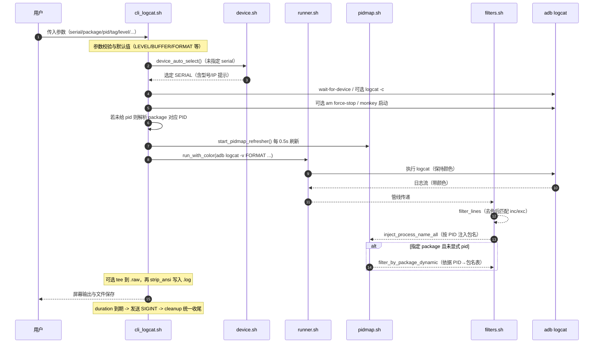
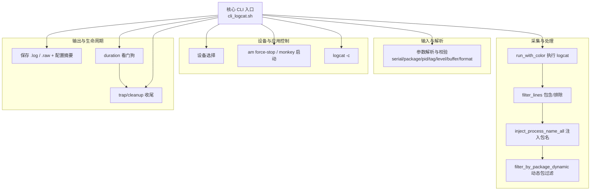

### cli_logcat.sh 使用手册（增强版 Logcat 采集与过滤）

本工具在原生 `adb logcat` 之上，提供设备自动选择、按包名/进程动态过滤、级别与 Tag 过滤、包含/排除正则、彩色输出与去色保存、进程名注入、定时退出、冷启动/重启应用、清空缓冲、跨缓冲区采集等能力，并通过模块化脚本实现清晰的职责划分与稳定的运行时管线。

### 特性总览
- **设备选择**: 未指定 `--serial` 时自动选择或交互选择设备。
- **包/进程过滤**: 支持 `--package` 自动解析 PID，或显式 `--pid`。
- **级别/Tag**: 支持多 Tag（逗号分隔），并配置全局级别 V/D/I/W/E/F/S。
- **缓冲区**: `main|system|events|radio|crash|all`，`all` 会展开为多缓冲并行读取。
- **正则过滤**: `--grep` 包含、`--exclude` 排除，匹配前自动去除 ANSI 颜色。
- **彩色与格式**: 默认 `color,threadtime,year`（关闭颜色后为 `threadtime,year`）。
- **历史与起点**: `--tail N` 或 `--since MM-DD HH:MM:SS.mmm`（互斥）。
- **输出保存**: `--save` 将去色文本保存到 `logs/*.log`，可选 `--raw-file` 同时保存彩色 `*.raw`。
- **进程名注入**: 在每行 Tag 的冒号前注入对应 PID 的进程名，便于定位来源。
- **运行控制**: `--duration SEC` 定时停止；`--clear` 清空缓冲；`--launch/--restart` 启动/重启包。
- **健壮性**: 统一的 `trap/cleanup`，后台刷新 PID 映射文件，降低延迟。

### 安装与依赖
- **adb**: 需要已安装 `adb`。macOS 可通过 `brew install android-platform-tools`。
- **script 命令**: 用于在管道中保留颜色。macOS 自带；若不可用将自动回退为直接执行。

### 快速开始
```bash
# 仅 1 台设备时自动选择；多台设备时交互选择
./cli_logcat.sh

# 指定设备与包，重启后拉日志，保存到 logs/
./cli_logcat.sh -s emulator-5554 -p com.demo.app --restart --launch -f

# 仅拉取 INFO 及以上，Tag 只看 ActivityTaskManager 与 MyTag，多缓冲区
./cli_logcat.sh -l I -t ActivityTaskManager,MyTag -b all

# 先输出最近 300 行，然后继续实时输出，并排除 noisy 内容
./cli_logcat.sh --tail 300 --exclude "noisy|debug" 

# 正则仅包含与网络相关的行，运行 120 秒后自动退出
./cli_logcat.sh -g "(HTTP|Socket|OkHttp)" --duration 120
```

### 参数说明
```text
-s, --serial SERIAL     指定设备序列号（未指定时：若仅 1 台自动选择；≥2 台交互选择）
-p, --package NAME      包名（自动解析 PID）
    --pid PID           指定 PID（优先于包名）
-t, --tag TAG           Tag（默认 *，支持逗号分隔多 Tag，如：TagA,TagB）
-l, --level LEVEL       V/D/I/W/E/F/S（默认 D）
-b, --buffer NAME       main/system/events/radio/crash/all（默认 main）
-g, --grep REGEX        包含过滤（正则）
    --exclude REGEX     排除过滤（正则）
-f, --save              保存到 logs/ 下带时间戳文件（终端彩色 + 文件去色）
-c, --clear             开始前清空 logcat 缓冲
    --launch            若有包名，尝试冷启动
    --restart           若有包名，先 force-stop 再启动（配合 --launch）
    --raw-file          同时保存“带 ANSI 颜色”的原始文件
    --tail N            先显示缓冲区最近 N 行，再继续实时输出（等价 logcat -T N）
    --since TIME        从指定时间开始（MM-DD HH:MM:SS.mmm），等价 logcat -T "TIME"
    --out DIR           输出目录（默认 logs/）
    --no-color          关闭彩色输出（便于匹配/复制）
    --duration SEC      运行指定秒数后自动结束
    --format FMT        指定 logcat -v 格式（默认 color,threadtime,year；配合 --no-color 默认为 threadtime,year）
-h, --help              帮助
```

### 关键行为与细节
- **设备选择**: 未传 `--serial` 时，自动枚举 `adb devices` 状态为 `device` 的设备；单台自动选择，多台交互选择（显示型号与 IP）。
- **级别/Tag 组合**:
  - 未指定 `-t/--tag` 时：应用 `*:<LEVEL>`。
  - 指定多个 Tag 时：为每个 Tag 应用 `<TAG>:<LEVEL>`，同时对其他 Tag 追加 `*:S` 静默，减少噪声。
- **缓冲区**: `-b all` 展开为 `-b main -b system -b events -b radio -b crash`。
- **格式与颜色**:
  - 默认 `color,threadtime,year`；若设置 `--no-color` 则移除 `color`。
  - 进程名注入与动态包过滤依赖于 `threadtime` 格式解析；若自定义 `--format` 移除 `threadtime`，相关能力可能失效。
- **正则过滤**: 在匹配之前会移除 ANSI 颜色，保证正则对屏幕显示与保存文件一致；包含与排除均为可选、可同时启用。
- **历史定位**: `--tail` 与 `--since` 互斥；内部映射为 `logcat -T`。
- **包/进程选择**:
  - 指定 `--pid` 时优先；若仅给 `--package` 则自动解析 PID（优先 `pidof -s`，兜底 `ps -A`）。
  - 未显式 `--pid` 且提供了 `--package` 时，会启用“动态按包名过滤”，可在应用重启后自动跟随新的 PID。
- **进程名注入**: 通过实时刷新 PID→进程名映射文件，将包名插入到 Tag 冒号前方，增强可读性（颜色位置保持正确）。
- **保存与原始文件**:
  - `--save` 会先把“运行配置摘要”写入 `.log`/`.raw` 文件开头；`.log` 为去色文本，`.raw` 为带颜色文本（可选）。
  - 终端输出始终保留颜色；保存时 `.raw` 通过 `tee -a` 落盘，`.log` 由去色管线写入。
- **定时退出**: `--duration` 启动看门狗，超时后向当前脚本发送 `SIGINT`，统一触发清理逻辑。
- **清理与稳定性**: 通过 `trap` 在 `INT/TERM/EXIT` 时回收后台任务、删除临时文件、杀死子进程并友好退出。
- **清空缓冲/应用控制**: `--clear` 对 `logcat -c`；`--restart` `am force-stop` 后可配合 `--launch` 冷启动。

### 运行时架构（模块与数据流）
```mermaid
graph TD
  A[cli_logcat.sh 主程序] --> U[lib/usage.sh\nusage() 帮助输出]
  A --> D[lib/device.sh\n设备自动/交互选择]
  A --> R[lib/runner.sh\nrun_with_color 保持颜色]
  A --> F[lib/filters.sh\nfilter_lines/strip_ansi\nfilter_by_package_dynamic]
  A --> P[lib/pidmap.sh\nPID 映射刷新与注入]

  subgraph 运行时管线
    R --> FL[filter_lines\n包含/排除正则]
    FL --> IPN[inject_process_name_all\n进程名注入]
    IPN -->|可选: 指定 package 且未显式 pid| FP[filter_by_package_dynamic\n按包名动态过滤]
  end

  A --> O[(logs/*.log, logs/*.raw)\n保存与配置摘要]
```

### 启动到退出的时序


### 功能结构图


### 输出文件与命名
- **目录**: 默认 `logs/`（可通过 `--out DIR` 指定）。
- **命名**: `logcat-<serial-or-device>-<package-or-all>-<YYYYmmdd-HHMMSS>.{log,raw}`。
- **文件头**: 若 `--save`，会在文件头写入一段“运行配置摘要”，便于复盘。
- **颜色**: `.raw` 保留颜色；`.log` 去色便于检索与拷贝。

### 常见用法示例
```bash
# 仅查看指定包（自动解析 PID），并且只看 ERROR 及以上
./cli_logcat.sh -p com.demo.app -l E

# 查看多 Tag，默认级别为 D（未显式设置 -l 时）
./cli_logcat.sh -t MyTag,ActivityManager

# 全缓冲区 + 正则包含 + 排除无关信息
./cli_logcat.sh -b all -g "(ANR|Crash|Exception)" --exclude "StrictMode|Choreographer"

# 无颜色模式（便于复制/grep），同时保存去色日志
./cli_logcat.sh --no-color -f

# 指定起始时间拉取历史并实时跟随
./cli_logcat.sh --since "12-19 14:30:00.000"

# 指定 PID（优先于包名）
./cli_logcat.sh --pid 12345 -t OkHttp -l I
```

### 兼容性与限制
- **依赖 threadtime**: 进程名注入与动态包过滤依赖 `threadtime` 样式行的解析；请勿移除该格式要素。
- **正则语法**: 过滤使用 Perl 正则（PCRE），与 `grep -E` 语法略有差异。
- **tail/since 互斥**: 两者不可同时使用，否则脚本会报错退出。
- **多设备交互**: 未指定 `--serial` 时、多设备场景需要交互输入序号。
- **权限与环境**: 需要 `adb` 可用且设备状态为 `device`；部分设备/ROM 的 `ps` 输出格式可能存在差异，脚本已有兜底处理。

### 开发者指南（代码结构）
- `cli_logcat.sh`: 主入口，负责参数解析、装配管线、文件保存与清理。
- `lib/usage.sh`: `usage()` 帮助信息。
- `lib/device.sh`: 设备自动/交互选择，显示型号与 IP。
- `lib/runner.sh`: `run_with_color`，在管线中保留颜色（优先使用 `script`）。
- `lib/filters.sh`: `filter_lines`（包含/排除）、`strip_ansi`、`filter_by_package_dynamic`（按包名动态过滤）。
- `lib/pidmap.sh`: 刷新 PID→进程名映射、`inject_process_name_all` 将包名注入到每行日志中。

### 变更记录
- 统一的运行配置摘要输出，便于保存再现。
- 新增定时结束、原始彩色文件保存、动态包过滤与 PID 名注入等增强能力。

### 反馈
如遇问题或建议，请附上使用命令、运行配置摘要与相关日志片段，便于快速定位。

